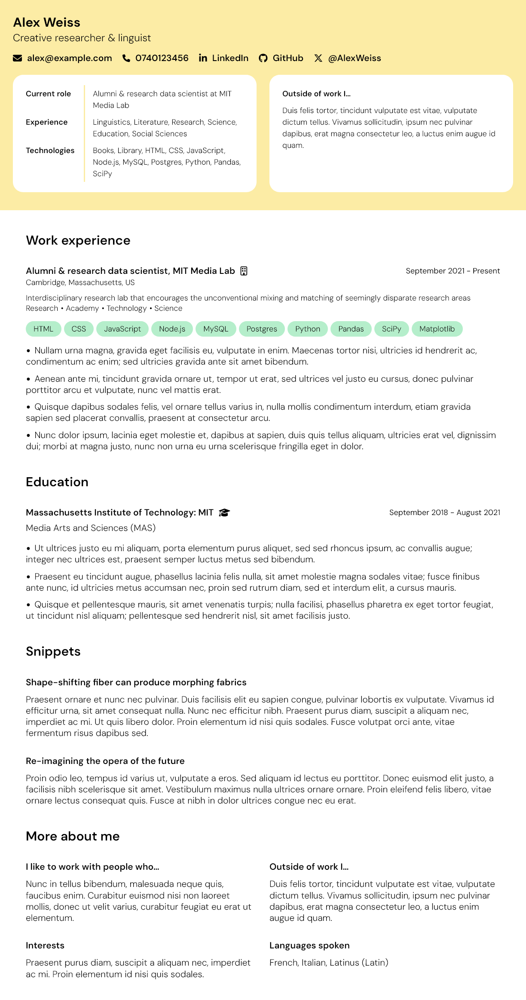

# Résumé template

A résumé template for personal use, built with Astro and customized with Tailwind CSS on Bun JavaScript runtime.

## Development

> [!NOTE]
> `bun` was used to install the dependencies, but `npm`, `Yarn` or `pnpm` can also be used.

Run a command from the root of the project, from a terminal:

| Command           | Action                                         |
| :---------------- | :--------------------------------------------- |
| `bun install`     | Install project dependencies                   |
| `bun run dev`     | Start a local dev server at `localhost:4321`   |
| `bun run build`   | Build project for production to `./dist/`      |
| `bun run preview` | Preview the build locally, before deploying    |
| `bun run format`  | Apply a consistent coding style to the project |
| `bun run svgo`    | Optimize SVG assets for the project            |

Find more commands in the [official documentation](https://docs.astro.build/en/reference/cli-reference) provided by Astro to further develop, build, and preview the project from a terminal window.

## Example

See the `sample-data` branch for an example résumé with sample data, or scroll below for a preview image.

> [!IMPORTANT]
> When creating a PDF after building the project for production, you may sometimes need to correct the layout of the pages using CSS. For example, you want to move the title of a work experience that is at the bottom of a page to a new page.

> [!TIP]
> Add the CSS style `page-break-before: always` or `page-break-after: always` to move the content to a new page.
> As an alternative, you can use the `break-before-page` and `break-after-page` classes from Tailwind CSS, but be sure to rebuild the project.

## Preview

